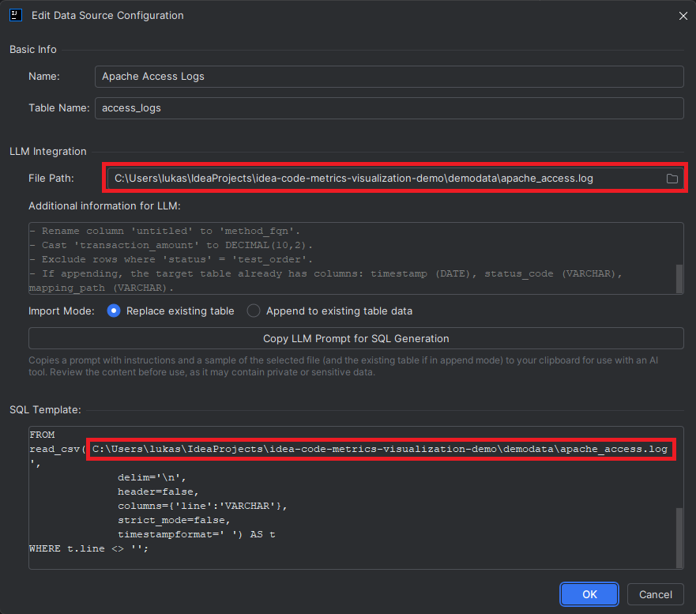
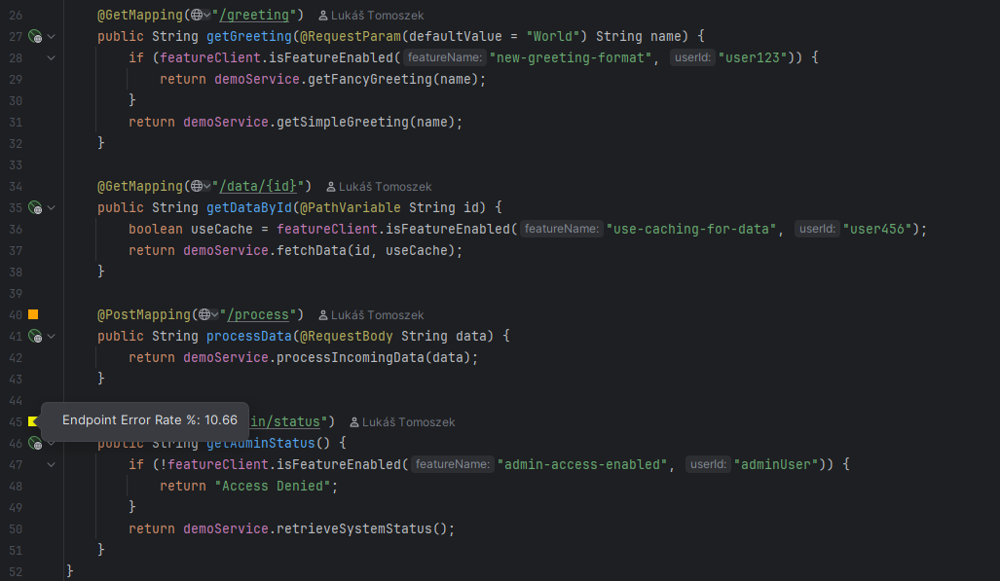
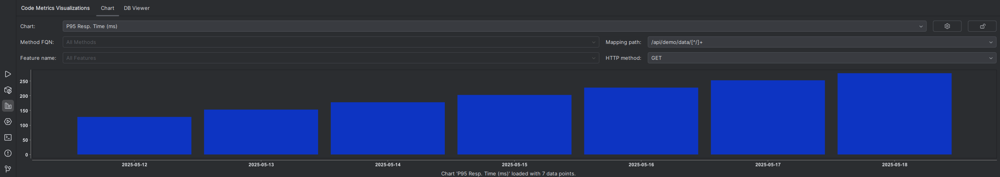
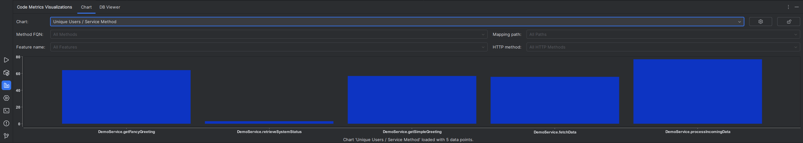
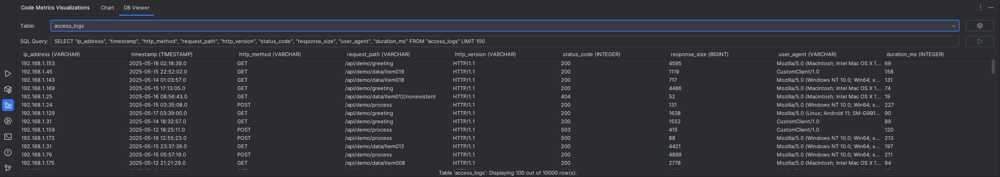

# Production Code Metrics Visualization - Demo Project

This project (`idea-code-metrics-visualization-demo`) serves as a demonstration environment for
the [Production Code Metrics Visualization IntelliJ Plugin](https://plugins.jetbrains.com/plugin/27403). It includes a sample Spring Boot
application, scripts to generate log data, and pre-configured settings to showcase the plugin's features.

## Features Demonstrated

Using this demo project with the plugin, you will be able to see:

* **Data Import:** Importing various log formats (Apache access logs, CSV application activity, CSV user features) into
  an embedded DuckDB database.
* **Feature Evaluators:** Configuration to identify feature flag checks within the demo code.
* **Line Markers:**
    * Displaying the ratio of users who have a specific feature enabled and used a service method, relative to all
      users who used that method.
    * Highlighting endpoints with a high ratio of failed API calls (e.g., status codes ≥ 400).
* **Charts:**
    * Visualizing P95 response times per day for the last week, filterable by API endpoint.
    * Charting the number of unique users per service method within the currently open Java file.
* **LLM Prompt Generation:** (Optional) Using the plugin's LLM prompt feature to help generate or refine SQL queries and
  coloring rules for the configurations.

---

## Prerequisites

1. **IntelliJ IDEA:** A recent version (compatible with the plugin).
2. **Java Development Kit (JDK):** JDK 17 or newer (the demo is configured for JDK 21).
3. **Maven:** Configured in your IntelliJ IDEA or system path (the project uses the Maven wrapper).
4. **Python 3:** To run the log generation script.
5. **[Production Code Metrics Visualization IntelliJ Plugin](https://plugins.jetbrains.com/plugin/27403):** Installed in your IntelliJ IDEA.

---

## Step-by-Step Guide to Use This Demo

### 1. Clone the Repository

Clone this demo project to your local machine:

```bash
git clone https://github.com/lukas-tomoszek/idea-code-metrics-visualization-demo.git
cd idea-code-metrics-visualization-demo
```

### 2. Open the Demo Project in IntelliJ IDEA

* Open IntelliJ IDEA.
* Select `File` > `Open...` and navigate to the cloned `idea-code-metrics-visualization-demo` directory.
* Trust the project if prompted, and allow IntelliJ IDEA to import the Maven project and resolve dependencies.

### 3. Generate Sample Log Data

The demo requires sample log files. A Python script is provided to generate these.

* Navigate to the `demodata` directory within the project:
  ```bash
  cd demodata
  ```
* Run the Python script:
  ```bash
  python generate_logs.py
  ```
  This will create/overwrite `apache_access.log`, `application_activity.csv`, and `user_features.csv` in the `demodata`
  folder.

### 4. Configure Data Sources (Update Absolute Paths)

The project includes pre-configured settings for the "Production Code Metrics Visualization" plugin. However, the paths
to the data source files are absolute and specific to the machine where they were configured. You'll need to update
these.

* Go to `File` > `Settings` > `Tools` > `Production Code Metrics Visualization` > `Data Sources`.
* You will see three pre-configured data sources:
    * `Apache Access Logs`
    * `App Activity Logs`
    * `User Features`


* **For each data source:**
    1. Select it and click **Edit** (or double-click it).
    2. In the dialog, locate the **"File Path"** field.
    3. Click the browse button next to the File Path field and navigate to the corresponding file within your local
       cloned project's `demodata` folder.
    4. Copy the same path to **SQL Template**.
    5. Click **OK** and **Apply** to save the changes for that data source.

  

* After updating paths for all three data sources:
    1. Select each data source one by one in the list.
    2. Click the **"Run Import SQL Now"** button (green triangle icon) for each. This will import the data into
       the embedded DuckDB. Wait for a success notification for each import.

### 5. (Optional) Use LLM Prompts to Regenerate SQL & Rules

This demo comes with SQL queries and rules already configured (in the `.idea/codeMetricsVisualizations/` XML files).
However, you can test the plugin's LLM prompt generation feature:

* Navigate to the `Line Markers` or `Charts` sections within the plugin settings.
* Select any existing configuration (e.g., "Feature Adoption %" line marker).
* Click **Edit**.
* (Optional) Provide a new "LLM Description" or modify the existing one.
* Click the **"Copy LLM Prompt for SQL Generation"** (or similar) button.
* Paste the prompt into your preferred LLM tool (ChatGPT, Claude, etc.).
* Use the SQL (and suggested rules for line markers) generated by the LLM to update the configuration in the plugin.
* **Save** the changes.

### 6. See the Results

After configuring data sources and (optionally) other settings, apply the changes and observe the plugin in action:

* **Line Markers:**
    * Open [DemoController.java](src/main/java/com/lukastomoszek/idea/codemetricsvisualizationsdemo/controller/DemoController.java): 
      You’ll see line markers next to annotations like `@PostMapping("/process")` or `@GetMapping("/admin/status")`, labeled "Endpoint Error Rate %".
    * Open [DemoService.java](src/main/java/com/lukastomoszek/idea/codemetricsvisualizationsdemo/service/DemoService.java): 
      You’ll see line markers next to feature flag checks like `"suppress-known-errors"` or `"experimental-logging"`, labeled "Feature Adoption %".

  

* **Charts:**
    * Open the **"Code Metrics Visualizations" Tool Window**.
    * Select the **"Chart"** tab.
    * From the chart selection dropdown:
        * Choose **"P95 Resp. Time (ms)"** and open [DemoController.java](src/main/java/com/lukastomoszek/idea/codemetricsvisualizationsdemo/controller/DemoController.java).
          You should see a chart of P95 response times for the last week. Try moving your caret to different endpoint 
          methods in `DemoController.java` to see the chart filters change dynamically (if the "lock context" button is off).
          
        * Choose **"Unique Users / Service Method"**: Open [DemoService.java](src/main/java/com/lukastomoszek/idea/codemetricsvisualizationsdemo/service/DemoService.java).
          The chart should display bars representing unique user counts for each method in that file (`getSimpleGreeting`, `getFancyGreeting`, etc.).
          

* **DB Viewer:**
    * In the "Code Metrics Visualizations" Tool Window, select the **"DB Viewer"** tab.
    * You should be able to select tables like `access_logs`, `app_activity`, and `user_feature_assignments` from the
      dropdown to inspect the imported data.
    

---

## Troubleshooting

* **No Line Markers/Charts Data:**
    * Ensure the data source paths were correctly updated and data was imported successfully (check DB Viewer).
    * Verify the SQL in your plugin configurations is correct for the imported table schemas.
    * Check IntelliJ IDEA's event log (`View` > `Tool Windows` > `Event Log`) or notifications for any errors from the
      plugin.

Enjoy exploring the features of the Production Code Metrics Visualization plugin!

## License

This project is licensed under the Apache License, Version 2.0. See the [LICENSE](LICENSE) file for details.
